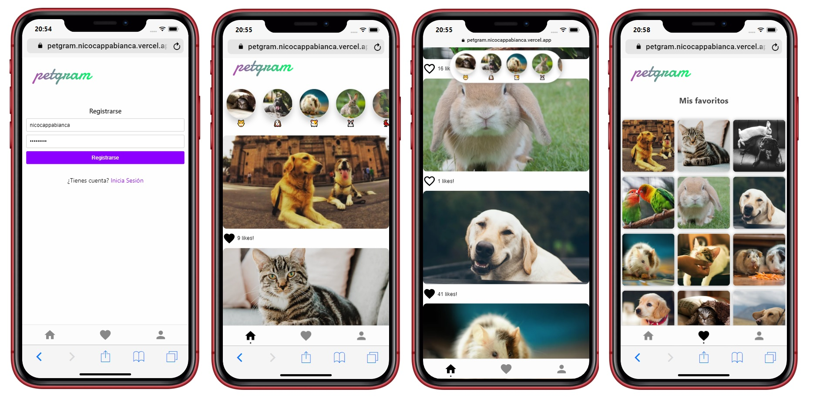

# Petgram :cat: :dog:

Project from advanced React.js course. 

[View live demo](https://petgram.nicocappabianca.vercel.app) :iphone: :computer:

## How does it work? :hammer_and_wrench:

Requiere NodeJS ^14.15.1

* `npm install` to install the dependencies. 
* `npm run dev` to run the development environment. 
* `npm run build` to builds the production application. 
* `npm run test` to open cypress tests. 
* `npm run serve:dev` to init webpack in development mode. 

## License :balance_scale:
MIT 

## Author :black_nib:
**Nicolás Cappabianca** - [LinkedIn](https://www.linkedin.com/in/nicolascappabianca/)